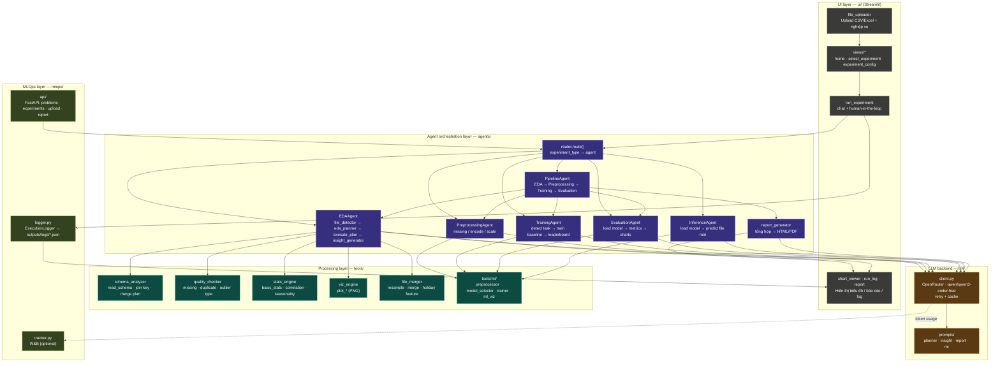

# Kiến trúc hệ thống AutoEDA (as-built)

> Tài liệu này mô tả kiến trúc **thực tế đã triển khai** của hệ thống (khác với bản thiết kế ban đầu ở `ARCHITECTURE.md`). Đọc file này để biết module nào gọi module nào, dữ liệu chảy ra sao.

## 0. Sơ đồ khối theo layer



**Cách đọc khi cần tối ưu/sửa:**
- Sai biểu đồ/insight EDA → vào `EDA` (agents/eda_agent.py) + `TOOLS` tương ứng (quality_checker/stats_engine/viz_engine).
- Sai kế hoạch tool calls / prompt LLM → `PROMPTS` (llm/prompts/) + agent gọi nó.
- Rate limit / đổi model → chỉ sửa `CLIENT` (llm/client.py), không đụng agent nào khác.
- Thêm bước ML mới → `tools/ml/` rồi wire vào `TRAIN`/`EVAL`/`INFER`.
- Sai luồng pipeline tổng (dừng/tiếp giữa các bước) → `PIPE` (agents/pipeline_agent.py).
- UI hiển thị sai/thiếu → `UI_RESULT` (ui/components/chart_viewer, run_log, views/report).
- Cần log/debug 1 lần chạy → `LOGGER` (outputs/logs/<run_id>.json) qua `UI_RUN`.

## 1. Tổng quan

AutoEDA là ứng dụng Streamlit cho phép người dùng:
1. Tạo "bài toán" (problem)
2. Chọn 1 trong 7 loại experiment (template)
3. Upload dữ liệu (CSV/Excel) + mô tả nghiệp vụ (optional)
4. Một AI agent (LLM qua OpenRouter) tự lập kế hoạch, chạy các tool phân tích/ML, sinh insight + biểu đồ + báo cáo tiếng Việt

Có thêm 1 FastAPI backend (`mlops/api/`) cung cấp REST API tương đương cho cùng logic agent, dùng trong test/headless.

---

## 2. Cấu trúc thư mục thực tế

```
VDT2026/
├── ui/
│   ├── app.py                      # Entry point Streamlit, session_state routing
│   ├── views/                      # (đổi tên từ "pages/" để tránh Streamlit auto multipage)
│   │   ├── home.py                 # Danh sách bài toán
│   │   ├── create_problem.py       # Form tạo bài toán
│   │   ├── select_experiment.py    # Chọn 1 trong 7 template
│   │   ├── experiment_config.py    # Upload file + cấu hình
│   │   ├── run_experiment.py       # Orchestration: route() -> agent.run() -> hiển thị kết quả
│   │   ├── run_history.py          # Danh sách run + execution log
│   │   └── report.py               # Xem/download báo cáo
│   └── components/
│       ├── file_uploader.py        # render_data_uploader / render_domain_uploader
│       ├── chat_box.py
│       ├── chart_viewer.py         # render_charts(list[png_path])
│       ├── run_log.py              # render_log(execution_log)
│       └── experiment_card.py      # render_card(...)
│
├── agents/
│   ├── base_agent.py               # ExperimentContext, AgentResult, BaseAgent
│   ├── router.py                   # route(experiment_type, context) -> agent instance | None
│   │
│   ├── eda_agent.py                # EDAAgent — pipeline EDA đầy đủ
│   ├── file_detector.py            # detect() — schema + join candidates + merge suggestion
│   ├── eda_planner.py              # plan() — LLM sinh {"steps":[...], "explanation": ...}
│   ├── insight_generator.py        # generate() — LLM diễn giải kết quả EDA
│   ├── report_generator.py         # generate() — LLM viết báo cáo + render HTML/PDF
│   │
│   ├── preprocessing_agent.py      # PreprocessingAgent — missing/encode/scale, lưu CSV
│   ├── training_agent.py           # TrainingAgent — detect task, train baseline, leaderboard
│   ├── evaluation_agent.py         # EvaluationAgent — load model, predict, metrics, charts
│   ├── inference_agent.py          # InferenceAgent — load model, predict data mới
│   │
│   └── pipeline_agent.py           # PipelineAgent — EDA -> Preprocessing -> Training -> Evaluation
│
├── tools/
│   ├── schema_analyzer.py          # MergePlan, read_schema, detect_datetime_columns,
│   │                                # detect_time_frequency, find_join_candidates, suggest_merge_plan
│   ├── quality_checker.py          # check_missing/duplicates/outliers_iqr/outliers_rolling/
│   │                                # type_mismatch/value_range
│   ├── stats_engine.py             # basic_stats, correlation_matrix, skewness_kurtosis,
│   │                                # time_series_decompose, lag_correlation, cross_file_correlation,
│   │                                # hourly/weekly/monthly_pattern
│   ├── viz_engine.py                # plot_distribution/heatmap/time_series/boxplot/
│   │                                # seasonal_pattern/missing_heatmap/decomposition/lag_correlation
│   ├── file_merger.py              # resample_to_frequency, merge_files, validate_merge_result,
│   │                                # add_holiday_feature
│   └── ml/
│       ├── preprocessor.py         # handle_missing, encode_categorical, scale_features,
│       │                            # create_time_features, train_test_split_time/random
│       ├── model_selector.py       # detect_task_type, get_baseline_models, suggest_models_by_llm
│       ├── trainer.py              # train_and_evaluate, cross_validate_model, compare_models,
│       │                            # get_best_model, save_model
│       └── ml_viz.py               # plot_confusion_matrix/feature_importance/
│                                    # actual_vs_predicted/residuals/model_comparison
│
├── llm/
│   ├── client.py                   # OpenRouter client (OpenAI SDK), call_llm(), cache + retry
│   ├── cache.py                    # in-memory cache theo hash(input), TTL 1h
│   └── prompts/
│       ├── planner_prompt.py       # PLANNER_SYSTEM / PLANNER_USER (kèm bảng tham số tool)
│       ├── insight_prompt.py       # INSIGHT_SYSTEM / INSIGHT_USER / DOMAIN_ELECTRICITY
│       ├── report_prompt.py        # REPORT_SYSTEM / REPORT_USER
│       └── ml_prompt.py            # TASK_DETECTION_USER / ML_EXPLANATION_USER
│
├── mlops/
│   ├── tracker.py                  # W&B: init_run/log_tokens/log_metrics/finish_run
│   ├── logger.py                   # ExecutionLogger — ghi/đọc outputs/logs/<run_id>.json
│   └── api/
│       ├── main.py                 # FastAPI app, app.state (problems/experiments/runs/...)
│       └── routes/
│           ├── problems.py         # POST/GET /problems
│           ├── experiments.py      # POST /experiments, POST /experiments/{id}/run, GET .../runs
│           ├── upload.py           # POST /upload
│           └── report.py           # GET /report/{job_id}
│
├── data/
│   ├── raw/                        # dataset gốc (phu_tai, ...)
│   └── processed/                  # CSV sau preprocessing / predictions
│
├── outputs/
│   ├── charts/, ml_charts/         # PNG biểu đồ
│   ├── models/                     # *.pkl model đã train
│   ├── reports/                    # report_<timestamp>.html/.pdf
│   └── logs/                       # <run_id>.json execution log
│
├── tests/                          # test_eda_agent, test_ml_pipeline, test_quality_checker,
│                                    # test_schema_analyzer, test_stats_engine
│
├── Dockerfile                      # python:3.11-slim + pango/cairo (WeasyPrint)
├── docker-compose.yml              # service ui (8501) + api (8000), volume .:/app (live-reload)
├── requirements.txt
├── .env / .env.example             # OPENROUTER_API_KEY, WANDB_API_KEY
└── .dockerignore
```

---

## 3. Luồng chạy chính (UI)

```
ui/app.py
  └─ session_state.page điều hướng giữa ui/views/*
      home -> create_problem -> select_experiment -> experiment_config -> run_experiment -> report / run_history
```

### `run_experiment.py` (orchestration)

```
context = ExperimentContext(...)            # build từ session_state
agent   = router.route(experiment_type, context)

if experiment_type == "Tùy chỉnh":
    call_llm(context.user_query)            # không qua agent

elif nhiều file & (EDA | Full Pipeline):
    file_detector.detect()                  # gợi ý merge -> user xác nhận

result = await agent.run(context)           # AgentResult
ExecutionLogger(run_id).log(...).save()     # outputs/logs/<run_id>.json

if EDA thành công:
    report_generator.generate(...)          # outputs/reports/report_<ts>.html
```

---

## 4. EDA Agent — chi tiết (luồng "kỹ nhất")

```
EDAAgent.run(context)
 1. detect()                  -> file_detector.detect(files, file_paths)
                                  -> schema_analyzer: read_schema, find_join_candidates, suggest_merge_plan
 2. _prepare_dataframe()       -> merge_files() nếu nhiều file & user đồng ý
                                  -> detect_datetime_columns -> set datetime index
 3. eda_planner.plan(user_query, schemas, domain_context)
        -> LLM (MODEL_70B) trả {"steps":[{"tool": ..., "params": {...}}], "explanation": ...}
 4. execute_plan(plan_data, df)
        - chuẩn hoá params (_normalize_params): "column" -> col/cols/col1+col2/by/period
          hoặc bỏ param nếu tool không nhận cột (check_missing, ...)
        - dispatch qua TOOL_REGISTRY -> tools/quality_checker | stats_engine | viz_engine
        - mỗi step: try/except, log {step, params, status, retry_count|error}
        - kết quả non-chart -> results[tool_name]; chart -> charts[]
 5. insight_generator.generate(results, domain_context)
        -> LLM (MODEL_70B) diễn giải tiếng Việt
 6. -> AgentResult(success, summary=explanation, data={results, merge_info},
                    charts, insights, log)
```

`TOOL_REGISTRY` (agents/eda_agent.py) ánh xạ tên tool (string từ LLM) -> hàm Python thật trong `tools/`.
`CHART_TOOLS` đánh dấu tool nào trả về đường dẫn ảnh (PNG) thay vì dữ liệu.

---

## 5. Pipeline Agent (Full Pipeline)

```
PipelineAgent.run(context)
  steps["eda"]            = EDAAgent(context).run()
  steps["preprocessing"]  = PreprocessingAgent(context).run()   # đọc context.extra["eda_insights"]
  steps["training"]       = TrainingAgent(replace(context, files={"processed": df})).run()
  steps["evaluation"]     = EvaluationAgent(ml_context).run()   # cần model_path + target_col từ training

_finalize(): gộp charts + execution_log của tất cả step,
             report_generator.generate(eda_results, ml_results, execution_log, charts)
```

Mỗi bước dừng sớm nếu `result.success == False` hoặc `context.extra["stop_after"]` khớp tên bước.
Log mỗi bước có thêm field `error` (để debug khi 1 agent con fail).

---

## 6. Training Agent

```
TrainingAgent.run(context)
  target_col = context.extra.get("target_col") hoặc LLM detect (TASK_DETECTION_USER, MODEL_70B)
  df_numeric = numeric columns, fill missing bằng median
  task_type  = model_selector.detect_task_type(df_numeric, target_col)
               -> "regression" | "classification" | "clustering" (nếu target_col=None/không tồn tại)

  split: train_test_split_time (nếu có cột datetime) hoặc train_test_split_random
  models = model_selector.get_baseline_models(task_type)
  results = trainer.train_and_evaluate(...)        # fit + metrics cho từng model
  leaderboard = trainer.compare_models(results)
  best_model  = trainer.get_best_model(results, DEFAULT_METRIC[task_type])
                -> raise ValueError nếu không model nào có metric đó (vd clustering 1-cluster)
  save_model() -> outputs/models/<best_name>.pkl
  explanation  = LLM (ML_EXPLANATION_USER, MODEL_70B)
```

---

## 7. LLM backend (`llm/`)

- **Provider hiện tại: OpenAI chính chủ** (`OpenAI` SDK, `OPENAI_API_KEY`)
- **Model**: `gpt-5.4-nano` (dùng cho cả `MODEL_70B` và `MODEL_8B` — 2 hằng số giữ để code agent không phải đổi tên, nhưng hiện trỏ cùng 1 model)
- `call_llm(prompt, system, model, use_cache=True)`:
  - cache theo `hash({prompt, system, model})`, TTL 1h (`llm/cache.py`)
  - retry tối đa 3 lần khi gặp lỗi 429 (rate limit), backoff `2**attempt`
  - log token usage qua `mlops.tracker.log_tokens` (best-effort, không raise nếu W&B tắt)
- `llm/prompts/`: mỗi agent có 1 file prompt riêng, `planner_prompt.py` liệt kê chữ ký tham số chính xác của từng tool để giảm lỗi LLM sinh sai param.

---

## 8. MLOps layer

- **`mlops/logger.py`**: `ExecutionLogger` — mỗi run ghi 1 file `outputs/logs/<run_id>.json` (list các bước: timestamp/step/decision/result). `run_history` đọc lại bằng `ExecutionLogger.load(run_id)`.
- **`mlops/tracker.py`**: tích hợp W&B, chỉ active khi có `WANDB_API_KEY` trong `.env`.
- **`mlops/api/`**: FastAPI app độc lập (port 8000), state lưu trong `app.state` (in-memory, không persist):
  - `POST/GET /problems`
  - `POST /experiments`, `POST /experiments/{id}/run`, `GET /experiments/{id}/runs`
  - `POST /upload`
  - `GET /report/{job_id}`

---

## 9. Triển khai (Docker)

`docker-compose.yml` chạy 2 service từ cùng `Dockerfile` (python:3.11-slim + lib pango/cairo cho WeasyPrint):

| Service | Lệnh | Port |
|---------|------|------|
| `ui`  | `streamlit run ui/app.py --server.address=0.0.0.0` | 8501 |
| `api` | `uvicorn mlops.api.main:app --reload` | 8000 |

Cả 2 mount `.:/app` để live-reload khi sửa code. Secrets (`GROQ/OPENROUTER/WANDB_API_KEY`) nạp qua `.env` (không build vào image, bị `.dockerignore` loại trừ).

---

## 10. Bảng 7 experiment template -> agent

| Template | Agent |
|----------|-------|
| Khám phá dữ liệu | `EDAAgent` |
| Xử lý dữ liệu | `PreprocessingAgent` |
| Huấn luyện mô hình | `TrainingAgent` |
| Đánh giá mô hình | `EvaluationAgent` |
| Suy luận mô hình | `InferenceAgent` |
| Tùy chỉnh | không có agent — gọi `call_llm(user_query)` trực tiếp |
| Full Pipeline | `PipelineAgent` (gộp EDA→Preprocessing→Training→Evaluation) |
